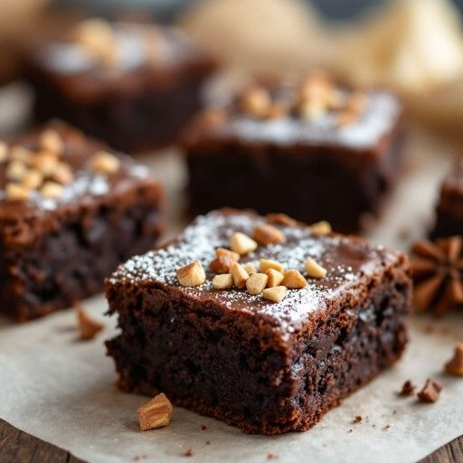

+++
title = "Menü"
date = '2025-04-13T18:33:31+02:00'
description = "Menü"
summary = "Menü"
# Categories are generally used for broader, top-level topics.
categories = [
 'dienstleistung',
]
# Tags are used for more specific, detailed topics.
tags = [
 'essen',
 'menü',
]
+++

## Menü

<table>
  <tr>
    <th>Foto</th>
    <th>Produkt</th>
    <th>Preis</th>
  </tr>
  <tr>
    <td></td>
    <td>Baklava</td>
    <td>5.00€/100g</td>
  </tr>
  <tr>
    <td></td>
    <td>Brötchen</td>
    <td>1.00€</td>
  </tr>
  <tr>
    <td></td>
    <td>Dunkles Brot</td>
    <td>5.00€/500g</td>
  </tr>
  <tr>
    <td></td>
    <td>Brownie</td>
    <td>1.00€</td>
  </tr>
  <tr>
    <td></td>
    <td>Croissant</td>
    <td>1.50€</td>
  </tr>
  <tr></tr>
</table>
